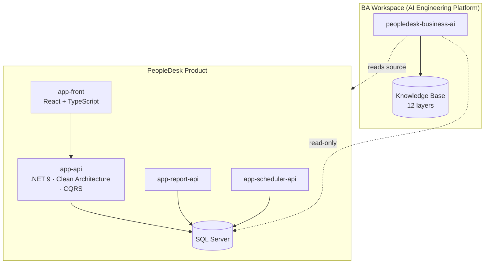
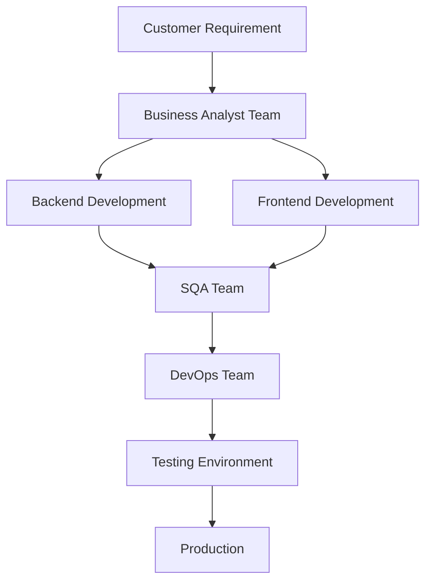
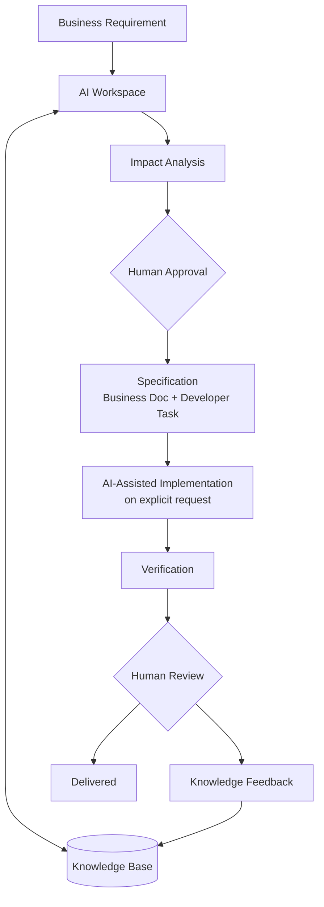
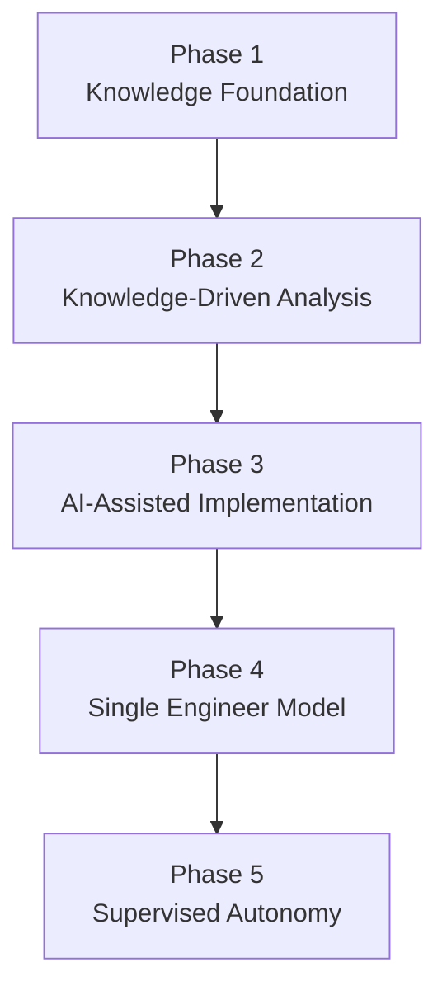

# 🧠 PeopleDesk BA Workspace

### How PeopleDesk works, how we engineer it, and where we are taking it

[](#)
[](#)
[](#)

> [!NOTE]
> This is the **single entry point** for the PeopleDesk BA Workspace concept. It is a complete high-level overview on its own — architecture, engineering approach, and the transformation journey (past → present → future). Detailed documents will be added in subfolders as the concept evolves; this page will always remain the map.

---

## 1. What PeopleDesk is

**PeopleDesk** is an enterprise HRMS SaaS covering nine business domains: **Employee, Attendance, Leave, Payroll, Shift, Roster, Organization, Recruitment, and Approval.**

The product is one system built from five repositories:

| Repository | Role | Stack |
|------------|------|-------|
| `app-api` | Core backend | ASP.NET Core (.NET 9), Clean Architecture, CQRS + MediatR, EF Core, SQL Server |
| `app-front` | Frontend | React + TypeScript, Vite, Redux |
| `app-report-api` | Reporting | .NET reporting service |
| `app-scheduler-api` | Background jobs | .NET scheduler service |
| `peopledesk-business-ai` | **BA Workspace** | Markdown-only AI workspace: Knowledge Base, modes, skills, templates |



The **BA Workspace** is the fifth repository's purpose: an AI-driven workspace that understands the whole product through a structured **Knowledge Base** and turns business requirements into analyses, specifications, and developer-ready tasks — grounded in how the system *actually* works.

---

## 2. Our engineering approach

One idea drives everything:

> **Make product knowledge explicit and machine-readable, make it the single source of truth, and let AI carry the engineering workload from that foundation — with humans approving every decision that matters.**

In practice:

- **Knowledge first.** The product (source code *and* database) is reverse-engineered into a 12-layer Knowledge Base — from enterprise context and business processes down to data, APIs, UI, security, and test cases. Facts are resolved there first; source code is consulted only for gaps, and every gap is fed back.
- **Analysis before action.** Every change starts with an impact analysis — database, API, UI, permissions, business rules, and regression scope are known before anything is specified or built.
- **Approval-gated automation.** AI proposes; humans approve. Knowledge updates, specifications, and implementation all pass explicit human gates.
- **Safety by construction.** The workspace is markdown-only, database access is read-only, schema changes ship as reviewed SQL scripts, and sensitive money logic with open questions is blocked from automation.
- **Every request makes the platform smarter.** Completed work merges what it learned back into the Knowledge Base — coverage is measured, never assumed.

---

## 3. The journey

### 3.1 Past — where we came from

Traditional multi-team delivery: every requirement crossed five specialized teams in sequence.



It worked — but every arrow was a handoff, and every handoff meant queue time, coordination meetings, and knowledge loss. Product knowledge lived in people's heads and scattered documents, and every estimate or bug fix paid a "rediscovery tax": someone re-reading code or finding the person who remembered.

### 3.2 Present — where we are today

The **Knowledge-Driven AI Engineering Platform (v2)** is operating now. The product has been reverse-engineered into the Knowledge Base, and requirements flow through a knowledge-grounded loop instead of a team pipeline:



**Live today:** knowledge-driven analysis and specification, impact analysis before every change, duplicate-feature detection, honest coverage reporting, and approval-gated knowledge sync. **Piloting:** AI-assisted implementation in the product repositories under human review.

### 3.3 Future — where we are going

Two destinations, reached incrementally:

1. **The Single Engineer Model** — one engineer, amplified by the workspace, owns a change end-to-end (analysis, backend, frontend, tests, docs). Specialists move up the stack to governance and review.
2. **Supervised autonomy** — for bounded, low-risk change classes, the AI operates the loop while humans govern policies and audit outcomes. Approval gates never disappear; they move from artifacts up to policies.

Beyond engineering, the same Knowledge Base will power new surfaces — first among them a **Customer Support AI** that answers from the same source of truth the engineers use, so what support says and what the product does can never drift apart.

---

## 4. Transformation roadmap



| Phase | Theme | Status |
|-------|-------|--------|
| 1 | Knowledge Foundation — build and validate the 12-layer Knowledge Base | 🟢 In production use |
| 2 | Knowledge-Driven Analysis — specs and impact analyses generated from knowledge | 🟢 In production use |
| 3 | AI-Assisted Implementation — approval-gated code with mandatory verification | 🟡 Piloting |
| 4 | Single Engineer Model — end-to-end delivery by one engineer + AI | ⚪ Planned |
| 5 | Supervised Autonomy — bounded change classes under human governance | ⚪ Future |

Phases advance on **evidence, not calendar**: knowledge coverage and confidence thresholds, verification pass rates, and regression results from pilots decide each promotion. Knowledge building never stops — it is the permanent foundation under every phase.

---

## 5. How this concept grows

This page stays the high-level map. As the concept matures, detail lands in subfolders — for example:

```text
peopledesk-ba-workspace/
├── README.md          ← this overview (always the entry point)
├── diagrams/          ← detailed diagrams, when needed
├── planning/          ← roadmap detail, milestones, research notes
└── designs/           ← architecture and design documents
```

> [!TIP]
> Rule of thumb: if a reader only opens this one page, they should still walk away understanding **what PeopleDesk is, how we engineer it, and where we are taking it.** Everything else is optional depth.
