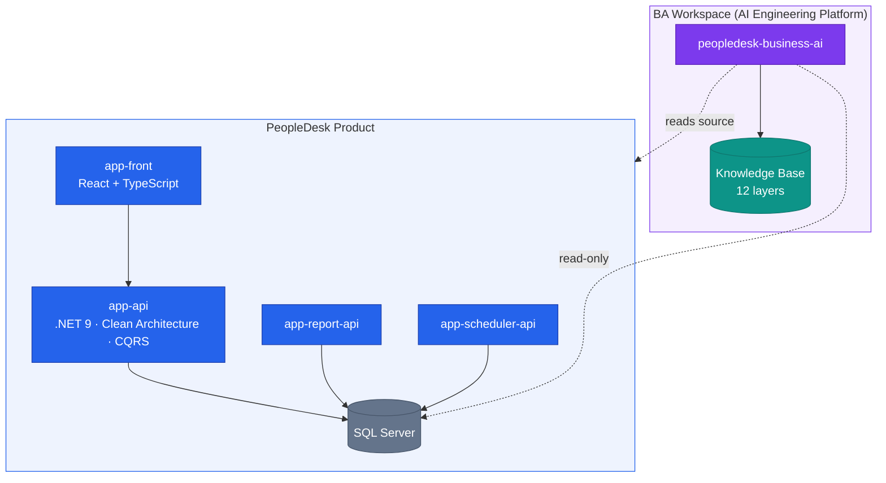
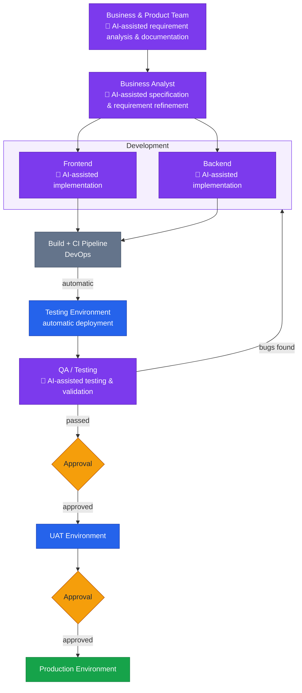
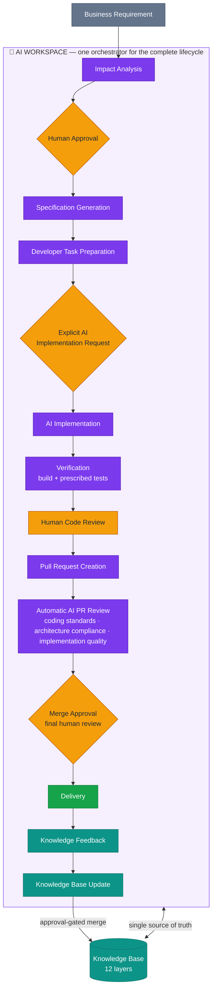
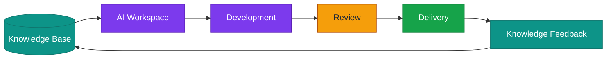
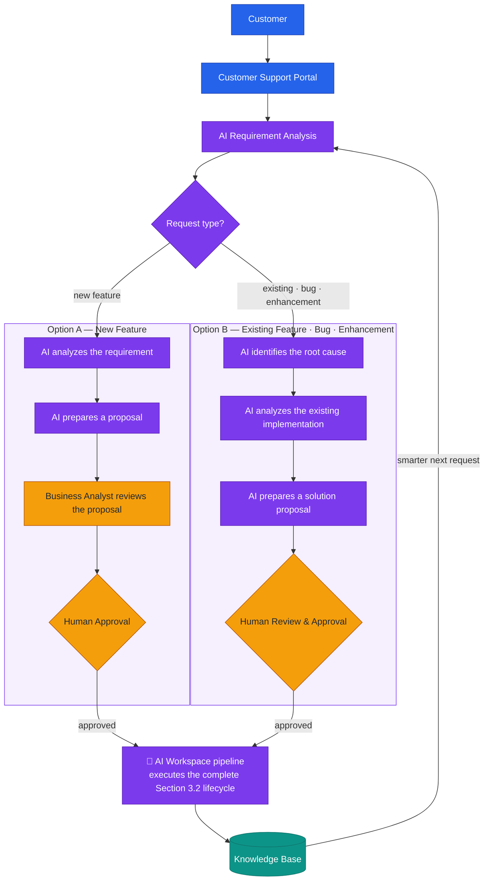
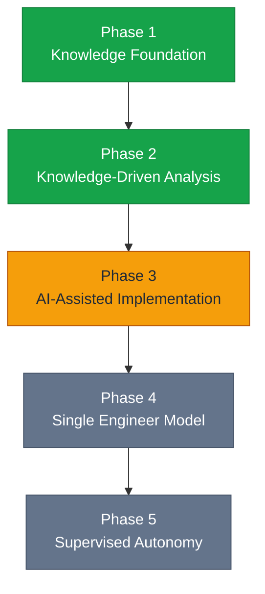

# 🧠 PeopleDesk BA Workspace

### How PeopleDesk works, how we engineer it, and where we are taking it

[](#)
[](#)
[](#)

> [!NOTE]
> This is the **single entry point** for the PeopleDesk BA Workspace concept. It is a complete high-level overview on its own — architecture, engineering approach, and the transformation journey (past → present → future). Detailed documents will be added in subfolders as the concept evolves; this page will always remain the map.

---

## 1. What PeopleDesk is

**PeopleDesk** is an enterprise HRMS SaaS covering nine business domains: **Employee, Attendance, Leave, Payroll, Shift, Roster, Organization, Recruitment, and Approval.**

The product is one system built from five repositories:

| Repository | Role | Stack |
|------------|------|-------|
| `app-api` | Core backend | ASP.NET Core (.NET 9), Clean Architecture, CQRS + MediatR, EF Core, SQL Server |
| `app-front` | Frontend | React + TypeScript, Vite, Redux |
| `app-report-api` | Reporting | .NET reporting service |
| `app-scheduler-api` | Background jobs | .NET scheduler service |
| `peopledesk-business-ai` | **BA Workspace** | Markdown-only AI workspace: Knowledge Base, modes, skills, templates |



The **BA Workspace** is the fifth repository's purpose: an AI-driven workspace that understands the whole product through a structured **Knowledge Base** and turns business requirements into analyses, specifications, and developer-ready tasks — grounded in how the system *actually* works.

---

## 2. Our engineering approach

One idea drives everything:

> **Make product knowledge explicit and machine-readable, make it the single source of truth, and let AI carry the engineering workload from that foundation — with humans approving every decision that matters.**

In practice:

- **Knowledge first.** The product (source code *and* database) is reverse-engineered into a 12-layer Knowledge Base — from enterprise context and business processes down to data, APIs, UI, security, and test cases. Facts are resolved there first; source code is consulted only for gaps, and every gap is fed back.
- **Analysis before action.** Every change starts with an impact analysis — database, API, UI, permissions, business rules, and regression scope are known before anything is specified or built.
- **Approval-gated automation.** AI proposes; humans approve. Knowledge updates, specifications, and implementation all pass explicit human gates.
- **Safety by construction.** The workspace is markdown-only, database access is read-only, schema changes ship as reviewed SQL scripts, and sensitive money logic with open questions is blocked from automation.
- **Every request makes the platform smarter.** Completed work merges what it learned back into the Knowledge Base — coverage is measured, never assumed.

---

## 3. The journey

Three stages — and the difference between them is **who orchestrates**:

| Stage | AI's role | Orchestration |
|-------|-----------|---------------|
| **3.1 Past** | AI assisted every team — business, product, BA, frontend, backend, QA | Traditional collaboration; humans coordinated everything manually |
| **3.2 Present** | One **AI Workspace** orchestrates the complete lifecycle, grounded in the Knowledge Base | Humans decide at explicit approval gates |
| **3.3 Future** | Customer requests automatically initiate the engineering pipeline | Humans govern a closed, self-improving loop |

> [!NOTE]
> **Color legend for all diagrams:** 🟣 purple = AI-executed · 🟠 amber = human decision / approval · 🩵 teal = knowledge · 🔵 blue = environments & infrastructure · 🟢 green = delivered / live.

### 3.1 Past — AI-assisted teams, manual orchestration

AI was never limited to development — it supported **every stage of the software lifecycle**. What made this the "past" is not the absence of AI, but that each team used AI **separately**, connected by traditional collaboration and manual orchestration:

- **Business & Product Team** — AI-assisted requirement analysis and documentation
- **Business Analyst (BA)** — AI-assisted specification and requirement refinement
- **Frontend Development** — AI-assisted implementation
- **Backend Development** — AI-assisted implementation
- **QA / Testing** — AI-assisted testing and validation



Deployment followed a fixed rhythm: the **Testing Environment deployed automatically** from CI, while **UAT** and **Production** each required an explicit **approval**.

The gaps were *between* the stages, not inside them: every handoff meant queue time, coordination meetings, and knowledge loss. Each team's AI started from zero context, product knowledge lived in people's heads and scattered documents, and every estimate or bug fix paid a "rediscovery tax" — someone re-reading code or finding the person who remembered.

### 3.2 Present — one AI Workspace orchestrates the lifecycle

The **Knowledge-Driven AI Engineering Platform (v2)** is operating now. The disconnected, per-team AI of the past is replaced by a **single AI Workspace** that orchestrates the complete engineering process — grounded in the Knowledge Base as its single source of truth, and gated by explicit human decisions:



Every pull request passes a **dual review** before it can merge:

1. **AI reviews automatically** the moment the PR is created — validating coding standards, checking architecture compliance, and verifying implementation quality.
2. **A human performs the final review** — merge approval always remains a human decision.

And when the Knowledge Base Update lands, one full turn of the lifecycle is complete. The same cycle then repeats for the next request — starting from a smarter Knowledge Base:



**Live today:** knowledge-driven analysis and specification, impact analysis before every change, duplicate-feature detection, honest coverage reporting, and approval-gated knowledge sync. **Piloting:** AI-assisted implementation with automatic AI PR review in the product repositories, under human merge approval.

### 3.3 Future — customer-support-driven AI engineering

The destination is an **autonomous, knowledge-driven engineering platform**: customer requests automatically initiate AI-powered requirement analysis, proposal generation, approval workflows, implementation, verification, deployment, and continuous knowledge evolution — one closed engineering loop.



The defining property: **every approved request — new feature or fix — enters the same standardized AI Workspace pipeline defined in Section 3.2.** There is one way software gets built, and the platform is fully self-improving: each delivery updates the Knowledge Base, and the updated knowledge sharpens the next requirement analysis.

The stepping stones remain the **Single Engineer Model** (one engineer supervising the workspace end-to-end) and **supervised autonomy** (AI operating bounded change classes while humans govern policies and audit outcomes). Approval gates never disappear — they move up from individual artifacts to policies.

---

## 4. Transformation roadmap



| Phase | Theme | Status |
|-------|-------|--------|
| 1 | Knowledge Foundation — build and validate the 12-layer Knowledge Base | 🟢 In production use |
| 2 | Knowledge-Driven Analysis — specs and impact analyses generated from knowledge | 🟢 In production use |
| 3 | AI-Assisted Implementation — approval-gated code with mandatory verification | 🟡 Piloting |
| 4 | Single Engineer Model — end-to-end delivery by one engineer + AI | ⚪ Planned |
| 5 | Supervised Autonomy — bounded change classes under human governance | ⚪ Future |

Phases advance on **evidence, not calendar**: knowledge coverage and confidence thresholds, verification pass rates, and regression results from pilots decide each promotion. Knowledge building never stops — it is the permanent foundation under every phase.

---

## 5. How this concept grows

This page stays the high-level map. As the concept matures, detail lands in subfolders — for example:

```text
peopledesk-ba-workspace/
├── README.md          ← this overview (always the entry point)
├── diagrams/          ← detailed diagrams, when needed
├── planning/          ← roadmap detail, milestones, research notes
└── designs/           ← architecture and design documents
```

> [!TIP]
> Rule of thumb: if a reader only opens this one page, they should still walk away understanding **what PeopleDesk is, how we engineer it, and where we are taking it.** Everything else is optional depth.
