# ✅ Software Development Team — WHAT List (Executive View)

### Every outcome a software development team must deliver — stated as WHAT, never HOW

[](#)
[](#)
[](#)

> [!NOTE]
> This is the **single entry point** for the **Software Development Team WHAT List** concept. It defines, at the executive level, **what** a software development team is accountable for delivering across the full product lifecycle — deliberately silent on **how** each outcome is achieved. Detailed documents (per-area breakdowns, checklists, maturity criteria) will be added in subfolders as the concept evolves; this page will always remain the map.

---

## 1. What a WHAT list is

A **WHAT list** names outcomes, not activities. Each item is a **verifiable state** — something either exists and is done, or it is not:

- ✅ *"CI/CD Pipeline Established"* — an outcome; an executive can ask "is it, yes or no?"
- ❌ *"Set up Jenkins with build agents"* — a HOW; it belongs to the team, not this list.

Because every item is phrased as a completed state, the list works three ways at once:

| Use | Who | Question it answers |
|-----|-----|---------------------|
| **Accountability map** | Executives | What must this team deliver overall? |
| **Status board** | Product / delivery leads | Which outcomes are done, in progress, missing? |
| **Completeness check** | The team itself | What did we forget to plan for? |

---

## 2. The lifecycle at a glance

The 13 areas cover the complete product lifecycle — from vision to continuous improvement:

```mermaid
flowchart LR

subgraph DEFINE["Define"]
    A1[1 · Product Vision]
    A2[2 · Requirement Management]
end

subgraph DESIGN["Design"]
    A3[3 · Product Design]
    A4[4 · Solution Architecture]
end

subgraph BUILD["Build"]
    A5[5 · Development]
    A6[6 · Quality Assurance]
end

subgraph RELEASE["Release"]
    A7[7 · DevOps & Infrastructure]
    A8[8 · Security & Compliance]
    A9[9 · Deployment]
    A10[10 · Documentation]
end

subgraph OPERATE["Operate & Improve"]
    A11[11 · Operations]
    A12[12 · Customer Success]
    A13[13 · Continuous Improvement]
end

DEFINE --> DESIGN --> BUILD --> RELEASE --> OPERATE
OPERATE -.feedback.-> DEFINE

classDef define fill:#2563EB,stroke:#1E40AF,color:#FFFFFF
classDef design fill:#7C3AED,stroke:#5B21B6,color:#FFFFFF
classDef build fill:#0D9488,stroke:#0F766E,color:#FFFFFF
classDef release fill:#F59E0B,stroke:#B45309,color:#1F2937
classDef operate fill:#16A34A,stroke:#15803D,color:#FFFFFF
class A1,A2 define
class A3,A4 design
class A5,A6 build
class A7,A8,A9,A10 release
class A11,A12,A13 operate
style DEFINE fill:#2563EB14,stroke:#2563EB
style DESIGN fill:#7C3AED14,stroke:#7C3AED
style BUILD fill:#0D948814,stroke:#0D9488
style RELEASE fill:#F59E0B14,stroke:#F59E0B
style OPERATE fill:#16A34A14,stroke:#16A34A
```



---

## 3. The WHAT List

### 1. Product Vision

- [ ] Product Vision Defined
- [ ] Product Roadmap Prepared
- [ ] Business Goals Aligned
- [ ] Success Metrics Defined

### 2. Requirement Management

- [ ] Business Requirements Collected
- [ ] Functional Requirements Finalized
- [ ] Non-Functional Requirements Defined
- [ ] Scope Approved
- [ ] Change Requests Managed

### 3. Product Design

- [ ] User Journey Defined
- [ ] Wireframes Prepared
- [ ] UI/UX Design Completed
- [ ] Design System Established

### 4. Solution Architecture

- [ ] System Architecture Defined
- [ ] Technology Stack Selected
- [ ] Database Architecture Defined
- [ ] Integration Strategy Defined
- [ ] Security Architecture Defined

### 5. Development

- [ ] Frontend Developed
- [ ] Backend Developed
- [ ] Mobile Application Developed
- [ ] APIs Developed
- [ ] Database Developed

### 6. Quality Assurance

- [ ] Test Cases Prepared
- [ ] Functional Testing Completed
- [ ] Regression Testing Completed
- [ ] Performance Testing Completed
- [ ] Security Testing Completed
- [ ] UAT Completed

### 7. DevOps & Infrastructure

- [ ] Development Environment Ready
- [ ] Testing Environment Ready
- [ ] Production Environment Ready
- [ ] CI/CD Pipeline Established
- [ ] Monitoring Enabled
- [ ] Backup Strategy Implemented

### 8. Security & Compliance

- [ ] Authentication Implemented
- [ ] Authorization Implemented
- [ ] Data Protection Implemented
- [ ] Audit Logging Enabled
- [ ] Compliance Requirements Met

### 9. Deployment

- [ ] Release Prepared
- [ ] Production Deployment Completed
- [ ] Rollback Plan Prepared
- [ ] Release Notes Published

### 10. Documentation

- [ ] Business Documentation Completed
- [ ] Technical Documentation Completed
- [ ] API Documentation Completed
- [ ] User Documentation Completed
- [ ] Knowledge Base Prepared

### 11. Operations

- [ ] Production Monitoring Enabled
- [ ] Incident Management Established
- [ ] Problem Management Established
- [ ] Change Management Established
- [ ] Service Level Monitoring Enabled

### 12. Customer Success

- [ ] User Training Completed
- [ ] Support Ready
- [ ] Feedback Collected
- [ ] Product Adoption Measured

### 13. Continuous Improvement

- [ ] Customer Feedback Reviewed
- [ ] Product Improvements Planned
- [ ] Technical Debt Managed
- [ ] Innovation Initiatives Planned

---

## 4. How to use this list

- **As an executive dashboard** — copy the list into a status document, mark each item ✅ / 🟡 / ❌, and the product's true delivery state is visible on one page.
- **As a project kickoff template** — walk the 13 areas at project start; any area with no owner is a planned gap or an accepted risk, decided consciously.
- **As a review lens** — at any milestone, the unchecked items *are* the remaining scope. No item on this list should be discovered late.

> [!TIP]
> The list is intentionally **flat and finite**: 13 areas, ~60 outcomes. If an item feels missing, it belongs either *under* one of these outcomes (a HOW detail) or as a proposed change to this page — the executive view should never grow into a task tracker.

---

## 5. How this concept grows

This page stays the high-level map. As the concept matures, detail lands in subfolders — for example:

```text
sdt-what-list/
├── README.md          ← this overview (always the entry point)
├── areas/             ← per-area deep dives (definitions of done, evidence required)
├── templates/         ← fillable status-board / kickoff templates
└── assessments/       ← completed assessments for specific products or releases
```

> [!TIP]
> Rule of thumb: if a reader only opens this one page, they should still walk away knowing **everything a software development team is accountable for delivering** — and be able to ask "is it done?" about any of it.
